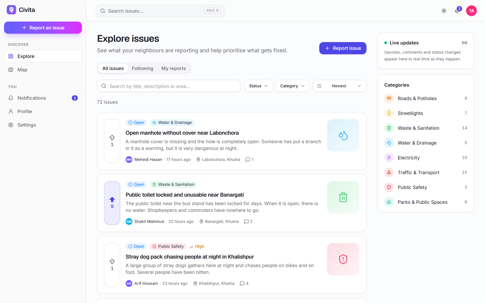
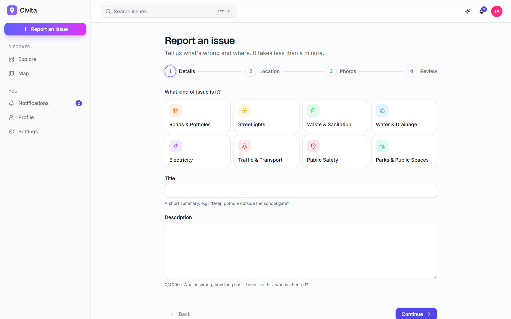
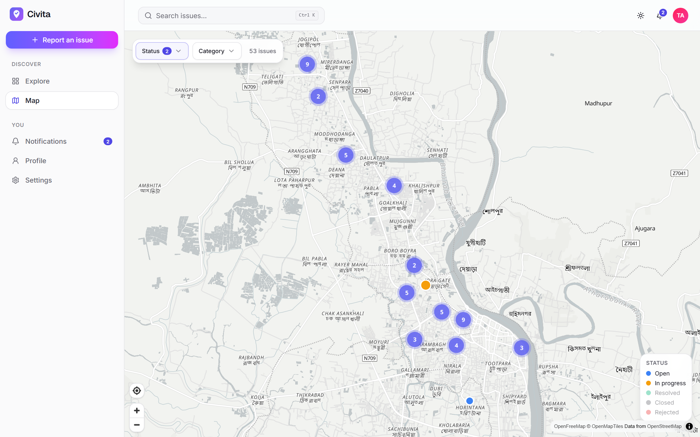
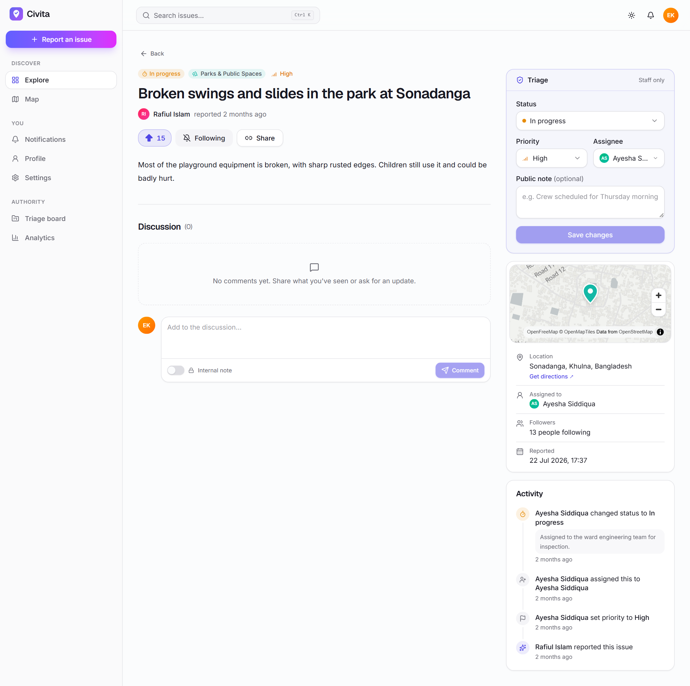
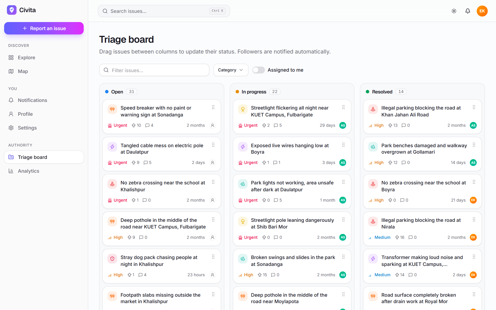
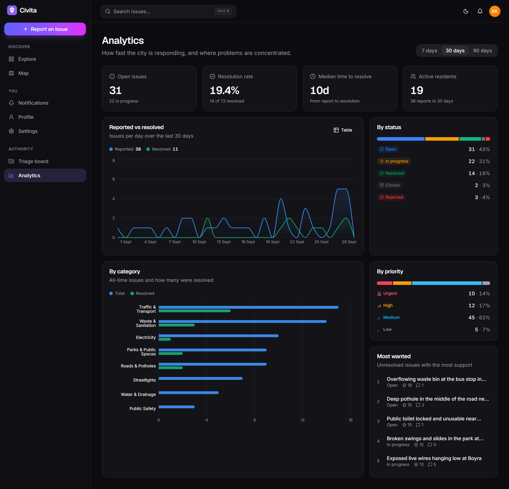
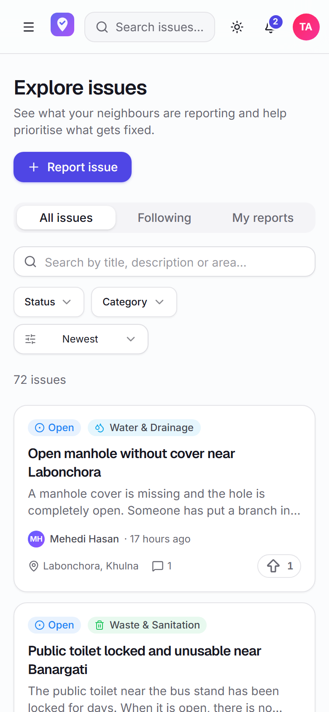
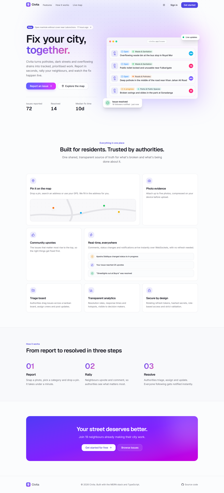
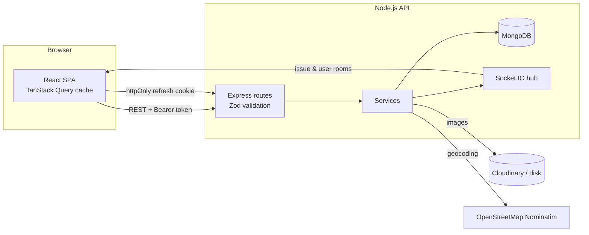

<div align="center">


# Civita

**Report local problems. Rally your neighbours. Watch them get fixed, live.**

A full-stack civic issue tracker. Residents pin potholes, broken streetlights and
waterlogging on a map; authorities triage, assign and resolve them on a real-time board.

[](https://github.com/k-i-mahi/proj1/actions/workflows/ci.yml)


[](LICENSE)



</div>

## Highlights

- **Map-first reporting.** A four-step report flow with a vector map picker, place search, GPS and automatic reverse geocoding. Photos are compressed in the browser before upload.
- **Real-time everything.** Comments, upvotes, status changes and notifications are pushed over Socket.IO, using per-issue rooms and a staff-only room for internal notes.
- **Authority tooling.** A drag-and-drop kanban triage board, assignment to staff, public status notes, internal notes, and an analytics dashboard.
- **Production-grade auth.** 15-minute JWT access tokens are kept in memory, and rotating refresh tokens are stored hashed in an httpOnly cookie, with reuse detection that revokes the whole session family. Password reset uses single-use hashed tokens, and responses never reveal whether an account exists.
- **One schema, both sides.** Zod schemas in a shared package validate API input, drive the React forms, and generate the OpenAPI docs.
- **Tested end to end.** 61 API integration tests (real MongoDB in memory), web unit tests, and 16 Playwright E2E tests, including a two-browser realtime test. All run in CI.

## Screenshots

| Report an issue                                                             | Live map                                                                          |
| --------------------------------------------------------------------------- | --------------------------------------------------------------------------------- |
|                  |             |
| **Issue page with staff triage**                                            | **Triage board**                                                                  |
|                  |                |
| **Analytics (dark mode)**                                                   | **Mobile**                                                                        |
|  |  |

<details>
<summary>Landing page</summary>

</details>

## Tech stack

| Layer    | Technology                                                                                                                                                                   |
| -------- | ---------------------------------------------------------------------------------------------------------------------------------------------------------------------------- |
| Frontend | React 19, Vite, TypeScript, React Router, TanStack Query, Tailwind CSS v4, Radix UI (shadcn-style components), React Hook Form, Motion, MapLibre GL, Recharts, dnd-kit, cmdk |
| Backend  | Node.js, Express 5, TypeScript, Mongoose, Socket.IO, Zod, JWT, bcrypt, Multer (+ Cloudinary), Pino, Helmet, rate limiting                                                    |
| Database | MongoDB with GeoJSON `2dsphere` indexes and TTL indexes for sessions, reset tokens and notifications                                                                         |
| Shared   | `@civita/shared`: Zod schemas, DTO types and constants used by both apps                                                                                                     |
| Quality  | Vitest, Supertest, mongodb-memory-server, Testing Library, Playwright, ESLint, Prettier                                                                                      |
| DevOps   | npm workspaces monorepo, Docker multi-stage builds, docker-compose, nginx, GitHub Actions                                                                                    |

## Architecture



```text
civita/
├── apps/
│   ├── api/            Express API: modules/{auth,issues,comments,users,...}, models, tests
│   └── web/            React app: pages, components/ui (design system), hooks, e2e tests
├── packages/
│   └── shared/         Zod schemas, types, constants shared by both apps
├── docs/               Rebuild plan and screenshots
└── docker-compose.yml  MongoDB + API + nginx-served web app
```

**Data model notes.** Votes, follows and comments live in their own collections with
unique compound indexes, not in unbounded arrays inside the issue document. Issues keep
denormalised counters updated with atomic `$inc`, which keeps documents small and
counts correct under concurrency. Every status or assignment change is written to an
`IssueEvent` timeline.

## Getting started

**Requirements:** Node.js 20.19+ and npm. MongoDB is optional; see step 2.

```bash
git clone https://github.com/k-i-mahi/proj1.git civita && cd civita
npm install

# 1. Start MongoDB. Pick one:
npm run dev:db              # zero-install local MongoDB (downloads a binary once)
# or: docker run -d -p 27017:27017 mongo:8

# 2. Load demo data (Khulna, Bangladesh)
npm run seed

# 3. Run the API (http://localhost:4000) and web app (http://localhost:5173)
npm run dev
```

Demo accounts (password `Password123`), also available as one-click buttons on the sign-in page:

| Role      | Email                  |
| --------- | ---------------------- |
| Resident  | `resident@civita.dev`  |
| Authority | `authority@civita.dev` |
| Admin     | `admin@civita.dev`     |

Configuration is optional in development. See [`apps/api/.env.example`](apps/api/.env.example)
for every setting (Cloudinary, SMTP, cookies, CORS).

### With Docker

```bash
docker compose up --build -d
docker compose exec api node dist/seed.js --force
# open http://localhost:8080 (set WEB_PORT to change it)
```

### From published images

Every release publishes Docker images to GitHub Packages:

```bash
docker pull ghcr.io/k-i-mahi/civita-api:latest
docker pull ghcr.io/k-i-mahi/civita-web:latest
```

## API

Interactive OpenAPI documentation, generated from the shared Zod schemas, is served at
**`/api/docs`** (raw spec at `/api/openapi.json`). All endpoints are versioned under `/api/v1`.

| Area     | Endpoints                                                                                                                                                                                                                                                      |
| -------- | -------------------------------------------------------------------------------------------------------------------------------------------------------------------------------------------------------------------------------------------------------------- |
| Auth     | `POST /auth/register` `login` `refresh` `logout` `forgot-password` `reset-password` `change-password`, `GET /auth/me`                                                                                                                                          |
| Issues   | `GET /issues` (search, filters, sort by newest/top/nearest, radius), `GET /issues/map`, `POST /issues`, `GET/PATCH/DELETE /issues/:id`, `PATCH /issues/:id/triage`, `PUT/DELETE /issues/:id/vote`, `PUT/DELETE /issues/:id/follow`, `GET /issues/:id/timeline` |
| Comments | `GET/POST /issues/:id/comments`, `DELETE /comments/:id`                                                                                                                                                                                                        |
| Other    | `categories`, `users`, `notifications`, `analytics/overview`, `stats`, `uploads/images`, `geo/reverse`, `geo/search`                                                                                                                                           |

Errors always have the same shape:

```json
{
  "error": {
    "code": "VALIDATION_ERROR",
    "message": "Some fields are invalid",
    "details": { "title": ["Use at least 8 characters"] },
    "requestId": "…"
  }
}
```

## Testing

```bash
npm test            # API integration tests + web unit tests
npm run test:e2e    # Playwright (needs the API, web app and seeded DB)
npm run lint && npm run typecheck
```

CI runs formatting, linting, type-checking, all tests, production builds, the Playwright
suite against a MongoDB service, and the Docker image builds on every push.

## Security

- Access tokens live only in memory. Refresh tokens are opaque, stored as SHA-256 hashes, rotated on every use, and scoped to `/api/v1/auth` in an httpOnly, SameSite cookie. Replaying a used token revokes all of that user's sessions.
- Role and active status are re-checked on every request, so demotions and bans take effect immediately.
- All input passes through strict Zod schemas, which also blocks NoSQL operator injection. Regex search input is escaped.
- Uploads are validated by magic bytes, not file extension or MIME type. Size limits and upload rate limits apply.
- Helmet security headers, an explicit CORS allow-list, request IDs, redacted auth headers in logs, and rate limits on auth endpoints.
- Login timing is equalised for unknown emails, and password reset never discloses whether an account exists.

## Deployment

The API is a single bundled Node.js process (`npm run build -w @civita/api`, then `node dist/server.js`),
and the web app is static files (`npm run build -w @civita/web`). Typical free-tier setup:

1. **Database:** MongoDB Atlas.
2. **API:** Render or Railway. Set `MONGODB_URI`, `JWT_ACCESS_SECRET`, `WEB_ORIGIN`, `API_PUBLIC_URL`, `TRUST_PROXY=1`, and `CLOUDINARY_URL` for persistent images.
3. **Web:** Vercel or Netlify. Either proxy `/api`, `/uploads` and `/socket.io` to the API (recommended, same-origin cookies), or set `VITE_API_URL` and use `COOKIE_SAMESITE=none` on the API.

## Background

Civita began as a university web-programming project. Version 2 is a ground-up rewrite
that fixes its security issues (the original password reset could be used to take over
accounts), replaces polling with WebSockets, moves to TypeScript and a tested layered
architecture, and redesigns the interface. The reasoning is in [`docs/PLAN.md`](docs/PLAN.md).

## License

[MIT](LICENSE) © mahi
